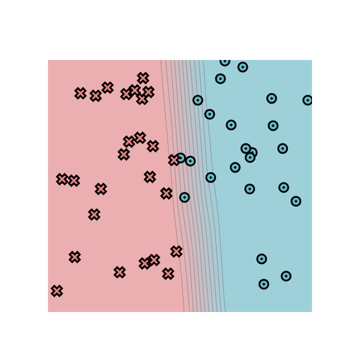
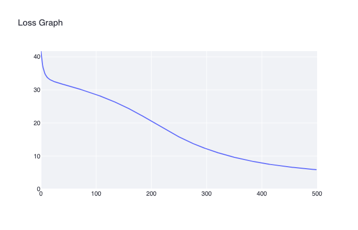
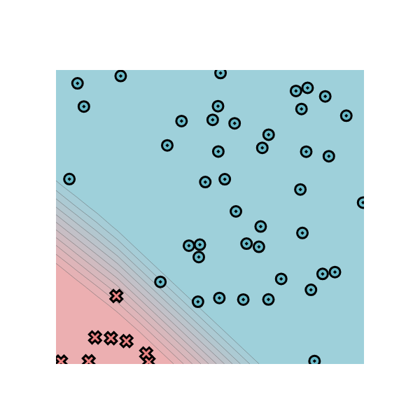
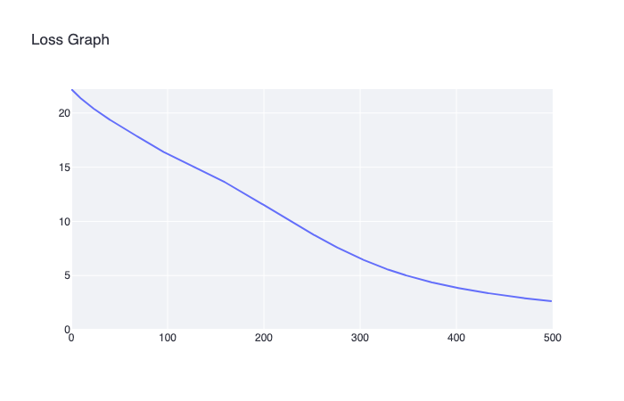
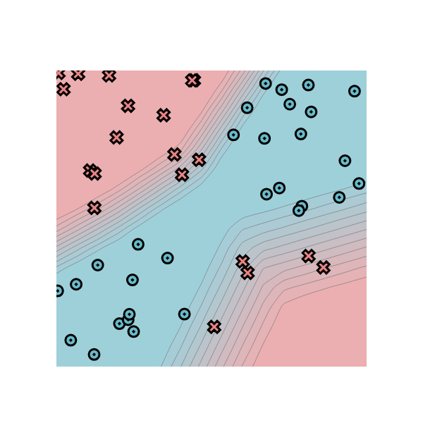
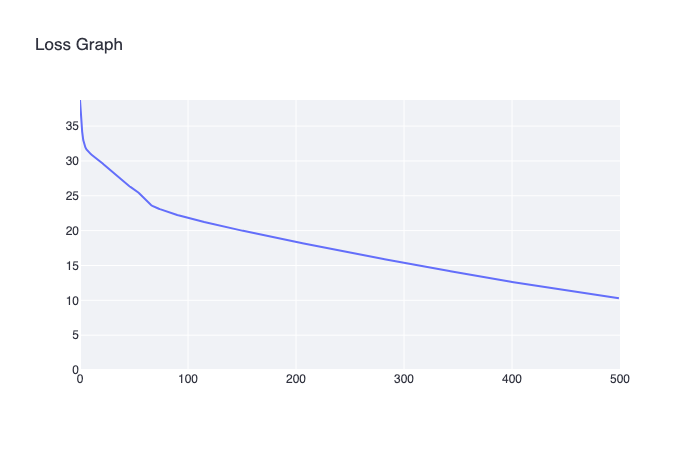
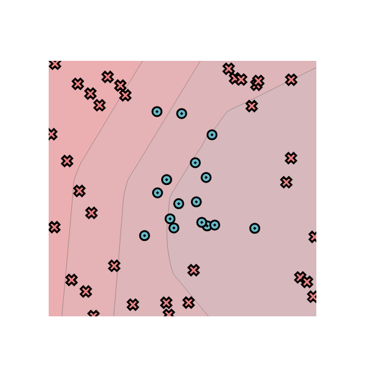
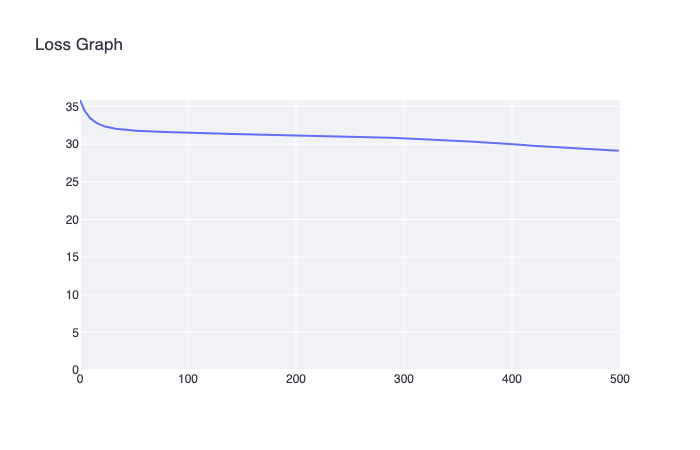

# minitorch
The full minitorch student suite. 

To access the autograder: 

* Module 0: https://classroom.github.com/a/qDYKZff9
* Module 1: https://classroom.github.com/a/6TiImUiy
* Module 2: https://classroom.github.com/a/0ZHJeTA0
* Module 3: https://classroom.github.com/a/U5CMJec1
* Module 4: https://classroom.github.com/a/04QA6HZK
* Quizzes: https://classroom.github.com/a/bGcGc12k

## Task 0.5
Dataset: simple

Number of points: 54

Size of hidden layer: 5

LR: 0.05

Epochs: 500

## Task 1.5

Everywhere lr=0.05, 50 points, 500 epochs, size of hidden layer = 10

### simple

[Logs](hw_output/1_5_simple.logs)

### diag

[Logs](hw_output/1_5_diag.logs)

### xor

[Logs](hw_output/1_5_xor.logs)

### circle

[Logs](hw_output/1_5_circle.logs)