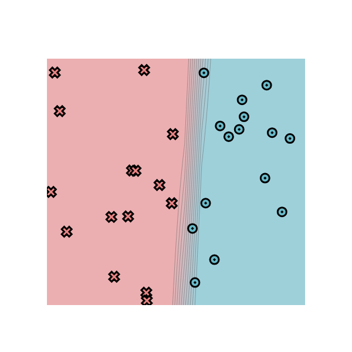
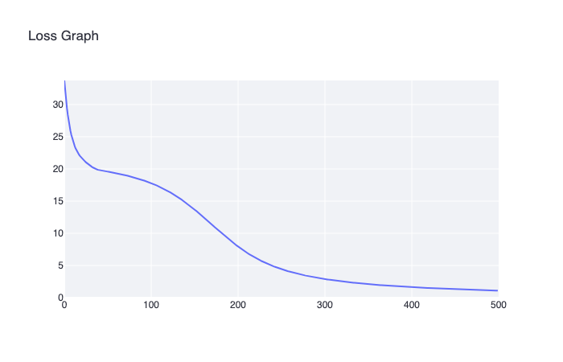
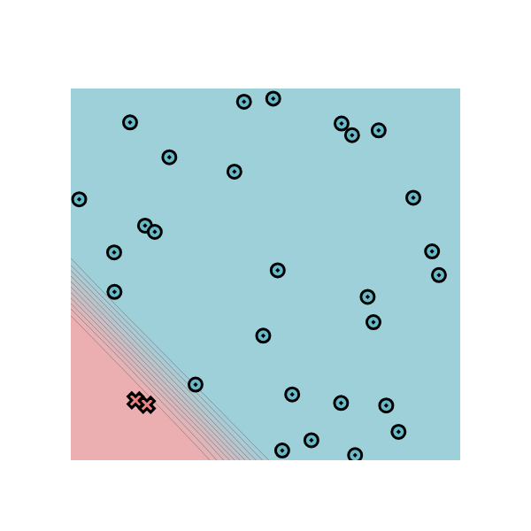
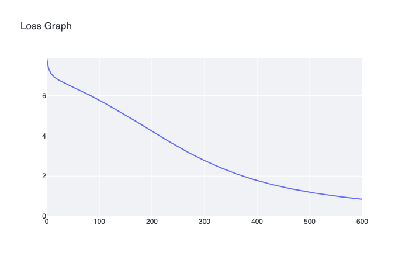
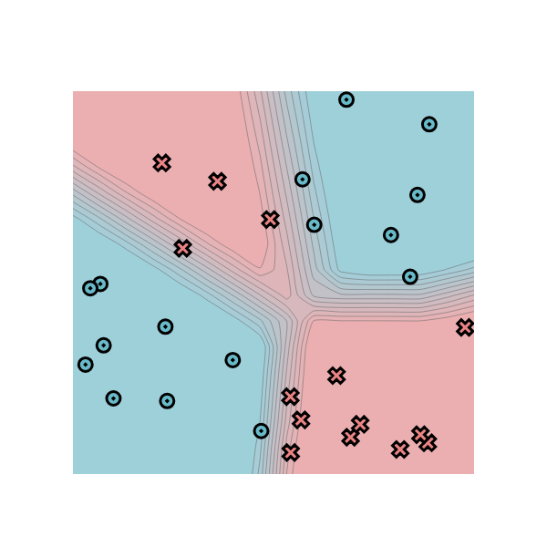
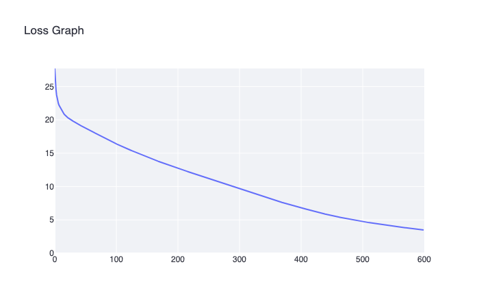
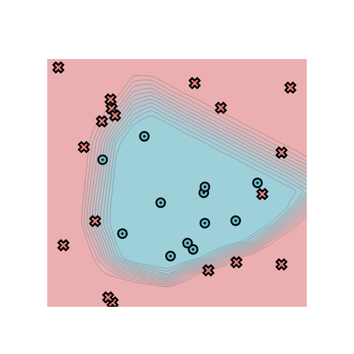
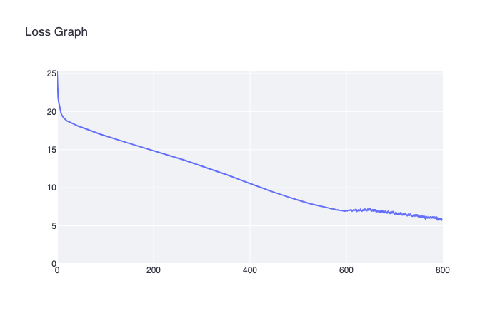

# minitorch
The full minitorch student suite. 


To access the autograder: 

* Module 0: https://classroom.github.com/a/qDYKZff9
* Module 1: https://classroom.github.com/a/6TiImUiy
* Module 2: https://classroom.github.com/a/0ZHJeTA0
* Module 3: https://classroom.github.com/a/U5CMJec1
* Module 4: https://classroom.github.com/a/04QA6HZK
* Quizzes: https://classroom.github.com/a/bGcGc12k

## Task 0.5
Dataset: simple

Number of points: 54

Size of hidden layer: 5

LR: 0.05

Epochs: 500


## Task 1.5

Everywhere lr=0.05, 50 points, 500 epochs, size of hidden layer = 10

### simple


[Logs](hw_output/1_5_simple.logs)

### diag


[Logs](hw_output/1_5_diag.logs)

### xor


[Logs](hw_output/1_5_xor.logs)

### circle


[Logs](hw_output/1_5_circle.logs)

## Task 2.5
lr=0.1, 30 points


### simple
500 epochs, hidden layer size = 5, train time per epoch 0.113s





[Logs](hw_output/2_5_simple.logs)

### diag
600 epochs, hidden layer size = 8, train time per epoch 0.223s





[Logs](hw_output/2_5_diag.logs)

### xor
600 epochs, hidden layer size = 8, train time per epoch 0.224s





[Logs](hw_output/2_5_xor.logs)

### circle
800 epochs, hidden layer size = 8, train time per epoch 0.225s





[Logs](hw_output/2_5_circle.logs)

## Task 3: Numba parallel diagnostics

Command:

```sh
python project/parallel_check.py
```

Output:

```text
MAP
 
================================================================================
 Parallel Accelerator Optimizing:  Function tensor_map.<locals>._map, 
/Users/vitalii/Documents/hse/dl2/hw1/minitorch-dl2-hw1/minitorch/fast_ops.py 
(154)  
================================================================================


Parallel loop listing for  Function tensor_map.<locals>._map, /Users/vitalii/Documents/hse/dl2/hw1/minitorch-dl2-hw1/minitorch/fast_ops.py (154) 
--------------------------------------------------------------------------------------|loop #ID
    def _map(                                                                         | 
        out: Storage,                                                                 | 
        out_shape: Shape,                                                             | 
        out_strides: Strides,                                                         | 
        in_storage: Storage,                                                          | 
        in_shape: Shape,                                                              | 
        in_strides: Strides,                                                          | 
    ) -> None:                                                                        | 
        aligned = len(out_shape) == len(in_shape)                                     | 
        if aligned:                                                                   | 
            for d in range(len(out_shape)):                                           | 
                if out_shape[d] != in_shape[d] or out_strides[d] != in_strides[d]:    | 
                    aligned = False                                                   | 
                    break                                                             | 
                                                                                      | 
        for i in prange(len(out)):----------------------------------------------------| #0
            if aligned:                                                               | 
                out[i] = fn(in_storage[i])                                            | 
            else:                                                                     | 
                out_index = np.empty(MAX_DIMS, dtype=np.int32)                        | 
                in_index = np.empty(MAX_DIMS, dtype=np.int32)                         | 
                to_index(i, out_shape, out_index)                                     | 
                broadcast_index(out_index, out_shape, in_shape, in_index)             | 
                out_pos = index_to_position(out_index, out_strides)                   | 
                in_pos = index_to_position(in_index, in_strides)                      | 
                out[out_pos] = fn(in_storage[in_pos])                                 | 
--------------------------------- Fusing loops ---------------------------------
Attempting fusion of parallel loops (combines loops with similar properties)...
Following the attempted fusion of parallel for-loops there are 1 parallel for-
loop(s) (originating from loops labelled: #0).
--------------------------------------------------------------------------------
----------------------------- Before Optimisation ------------------------------
--------------------------------------------------------------------------------
------------------------------ After Optimisation ------------------------------
Parallel structure is already optimal.
--------------------------------------------------------------------------------
--------------------------------------------------------------------------------
 
---------------------------Loop invariant code motion---------------------------
Allocation hoisting:
The memory allocation derived from the instruction at 
/Users/vitalii/Documents/hse/dl2/hw1/minitorch-dl2-hw1/minitorch/fast_ops.py 
(173) is hoisted out of the parallel loop labelled #0 (it will be performed 
before the loop is executed and reused inside the loop):
   Allocation:: out_index = np.empty(MAX_DIMS, dtype=np.int32)
    - numpy.empty() is used for the allocation.
The memory allocation derived from the instruction at 
/Users/vitalii/Documents/hse/dl2/hw1/minitorch-dl2-hw1/minitorch/fast_ops.py 
(174) is hoisted out of the parallel loop labelled #0 (it will be performed 
before the loop is executed and reused inside the loop):
   Allocation:: in_index = np.empty(MAX_DIMS, dtype=np.int32)
    - numpy.empty() is used for the allocation.
None
ZIP
 
================================================================================
 Parallel Accelerator Optimizing:  Function tensor_zip.<locals>._zip, 
/Users/vitalii/Documents/hse/dl2/hw1/minitorch-dl2-hw1/minitorch/fast_ops.py 
(206)  
================================================================================


Parallel loop listing for  Function tensor_zip.<locals>._zip, /Users/vitalii/Documents/hse/dl2/hw1/minitorch-dl2-hw1/minitorch/fast_ops.py (206) 
---------------------------------------------------------------------------------------|loop #ID
    def _zip(                                                                          | 
        out: Storage,                                                                  | 
        out_shape: Shape,                                                              | 
        out_strides: Strides,                                                          | 
        a_storage: Storage,                                                            | 
        a_shape: Shape,                                                                | 
        a_strides: Strides,                                                            | 
        b_storage: Storage,                                                            | 
        b_shape: Shape,                                                                | 
        b_strides: Strides,                                                            | 
    ) -> None:                                                                         | 
        aligned = len(out_shape) == len(a_shape) and len(out_shape) == len(b_shape)    | 
        if aligned:                                                                    | 
            for d in range(len(out_shape)):                                            | 
                if (                                                                   | 
                    out_shape[d] != a_shape[d]                                         | 
                    or out_shape[d] != b_shape[d]                                      | 
                    or out_strides[d] != a_strides[d]                                  | 
                    or out_strides[d] != b_strides[d]                                  | 
                ):                                                                     | 
                    aligned = False                                                    | 
                    break                                                              | 
                                                                                       | 
        for i in prange(len(out)):-----------------------------------------------------| #1
            if aligned:                                                                | 
                out[i] = fn(a_storage[i], b_storage[i])                                | 
            else:                                                                      | 
                out_index = np.empty(MAX_DIMS, dtype=np.int32)                         | 
                a_index = np.empty(MAX_DIMS, dtype=np.int32)                           | 
                b_index = np.empty(MAX_DIMS, dtype=np.int32)                           | 
                to_index(i, out_shape, out_index)                                      | 
                broadcast_index(out_index, out_shape, a_shape, a_index)                | 
                broadcast_index(out_index, out_shape, b_shape, b_index)                | 
                out_pos = index_to_position(out_index, out_strides)                    | 
                a_pos = index_to_position(a_index, a_strides)                          | 
                b_pos = index_to_position(b_index, b_strides)                          | 
                out[out_pos] = fn(a_storage[a_pos], b_storage[b_pos])                  | 
--------------------------------- Fusing loops ---------------------------------
Attempting fusion of parallel loops (combines loops with similar properties)...
Following the attempted fusion of parallel for-loops there are 1 parallel for-
loop(s) (originating from loops labelled: #1).
--------------------------------------------------------------------------------
----------------------------- Before Optimisation ------------------------------
--------------------------------------------------------------------------------
------------------------------ After Optimisation ------------------------------
Parallel structure is already optimal.
--------------------------------------------------------------------------------
--------------------------------------------------------------------------------
 
---------------------------Loop invariant code motion---------------------------
Allocation hoisting:
The memory allocation derived from the instruction at 
/Users/vitalii/Documents/hse/dl2/hw1/minitorch-dl2-hw1/minitorch/fast_ops.py 
(233) is hoisted out of the parallel loop labelled #1 (it will be performed 
before the loop is executed and reused inside the loop):
   Allocation:: out_index = np.empty(MAX_DIMS, dtype=np.int32)
    - numpy.empty() is used for the allocation.
The memory allocation derived from the instruction at 
/Users/vitalii/Documents/hse/dl2/hw1/minitorch-dl2-hw1/minitorch/fast_ops.py 
(234) is hoisted out of the parallel loop labelled #1 (it will be performed 
before the loop is executed and reused inside the loop):
   Allocation:: a_index = np.empty(MAX_DIMS, dtype=np.int32)
    - numpy.empty() is used for the allocation.
The memory allocation derived from the instruction at 
/Users/vitalii/Documents/hse/dl2/hw1/minitorch-dl2-hw1/minitorch/fast_ops.py 
(235) is hoisted out of the parallel loop labelled #1 (it will be performed 
before the loop is executed and reused inside the loop):
   Allocation:: b_index = np.empty(MAX_DIMS, dtype=np.int32)
    - numpy.empty() is used for the allocation.
None
REDUCE
 
================================================================================
 Parallel Accelerator Optimizing:  Function tensor_reduce.<locals>._reduce, 
/Users/vitalii/Documents/hse/dl2/hw1/minitorch-dl2-hw1/minitorch/fast_ops.py 
(266)  
================================================================================


Parallel loop listing for  Function tensor_reduce.<locals>._reduce, /Users/vitalii/Documents/hse/dl2/hw1/minitorch-dl2-hw1/minitorch/fast_ops.py (266) 
-------------------------------------------------------------------|loop #ID
    def _reduce(                                                   | 
        out: Storage,                                              | 
        out_shape: Shape,                                          | 
        out_strides: Strides,                                      | 
        a_storage: Storage,                                        | 
        a_shape: Shape,                                            | 
        a_strides: Strides,                                        | 
        reduce_dim: int,                                           | 
    ) -> None:                                                     | 
        for i in prange(len(out)):---------------------------------| #2
            out_index = np.empty(MAX_DIMS, dtype=np.int32)         | 
            to_index(i, out_shape, out_index)                      | 
            out_pos = index_to_position(out_index, out_strides)    | 
            a_pos = index_to_position(out_index, a_strides)        | 
            step = a_strides[reduce_dim]                           | 
            acc = out[out_pos]                                     | 
            for j in range(a_shape[reduce_dim]):                   | 
                acc = fn(acc, a_storage[a_pos + j * step])         | 
            out[out_pos] = acc                                     | 
--------------------------------- Fusing loops ---------------------------------
Attempting fusion of parallel loops (combines loops with similar properties)...
Following the attempted fusion of parallel for-loops there are 1 parallel for-
loop(s) (originating from loops labelled: #2).
--------------------------------------------------------------------------------
----------------------------- Before Optimisation ------------------------------
--------------------------------------------------------------------------------
------------------------------ After Optimisation ------------------------------
Parallel structure is already optimal.
--------------------------------------------------------------------------------
--------------------------------------------------------------------------------
 
---------------------------Loop invariant code motion---------------------------
Allocation hoisting:
The memory allocation derived from the instruction at 
/Users/vitalii/Documents/hse/dl2/hw1/minitorch-dl2-hw1/minitorch/fast_ops.py 
(276) is hoisted out of the parallel loop labelled #2 (it will be performed 
before the loop is executed and reused inside the loop):
   Allocation:: out_index = np.empty(MAX_DIMS, dtype=np.int32)
    - numpy.empty() is used for the allocation.
None
MATRIX MULTIPLY
 
================================================================================
 Parallel Accelerator Optimizing:  Function _tensor_matrix_multiply, 
/Users/vitalii/Documents/hse/dl2/hw1/minitorch-dl2-hw1/minitorch/fast_ops.py 
(289)  
================================================================================


Parallel loop listing for  Function _tensor_matrix_multiply, /Users/vitalii/Documents/hse/dl2/hw1/minitorch-dl2-hw1/minitorch/fast_ops.py (289) 
--------------------------------------------------------------------------------------------|loop #ID
def _tensor_matrix_multiply(                                                                | 
    out: Storage,                                                                           | 
    out_shape: Shape,                                                                       | 
    out_strides: Strides,                                                                   | 
    a_storage: Storage,                                                                     | 
    a_shape: Shape,                                                                         | 
    a_strides: Strides,                                                                     | 
    b_storage: Storage,                                                                     | 
    b_shape: Shape,                                                                         | 
    b_strides: Strides,                                                                     | 
) -> None:                                                                                  | 
    """                                                                                     | 
    NUMBA tensor matrix multiply function.                                                  | 
                                                                                            | 
    Should work for any tensor shapes that broadcast as long as                             | 
                                                                                            | 
    ```                                                                                     | 
    assert a_shape[-1] == b_shape[-2]                                                       | 
    ```                                                                                     | 
                                                                                            | 
    Optimizations:                                                                          | 
                                                                                            | 
    * Outer loop in parallel                                                                | 
    * No index buffers or function calls                                                    | 
    * Inner loop should have no global writes, 1 multiply.                                  | 
                                                                                            | 
                                                                                            | 
    Args:                                                                                   | 
        out (Storage): storage for `out` tensor                                             | 
        out_shape (Shape): shape for `out` tensor                                           | 
        out_strides (Strides): strides for `out` tensor                                     | 
        a_storage (Storage): storage for `a` tensor                                         | 
        a_shape (Shape): shape for `a` tensor                                               | 
        a_strides (Strides): strides for `a` tensor                                         | 
        b_storage (Storage): storage for `b` tensor                                         | 
        b_shape (Shape): shape for `b` tensor                                               | 
        b_strides (Strides): strides for `b` tensor                                         | 
                                                                                            | 
    Returns:                                                                                | 
        None : Fills in `out`                                                               | 
    """                                                                                     | 
    a_batch_stride = a_strides[0] if a_shape[0] > 1 else 0                                  | 
    b_batch_stride = b_strides[0] if b_shape[0] > 1 else 0                                  | 
                                                                                            | 
    rows = out_shape[-2]                                                                    | 
    cols = out_shape[-1]                                                                    | 
    inner = a_shape[-1]                                                                     | 
    matrix_size = rows * cols                                                               | 
                                                                                            | 
    for ordinal in prange(len(out)):--------------------------------------------------------| #3
        batch = ordinal // matrix_size                                                      | 
        rem = ordinal - batch * matrix_size                                                 | 
        row = rem // cols                                                                   | 
        col = rem - row * cols                                                              | 
                                                                                            | 
        out_pos = batch * out_strides[0] + row * out_strides[-2] + col * out_strides[-1]    | 
        a_pos = batch * a_batch_stride + row * a_strides[-2]                                | 
        b_pos = batch * b_batch_stride + col * b_strides[-1]                                | 
        acc = 0.0                                                                           | 
        for k in range(inner):                                                              | 
            acc += a_storage[a_pos + k * a_strides[-1]] * b_storage[                        | 
                b_pos + k * b_strides[-2]                                                   | 
            ]                                                                               | 
        out[out_pos] = acc                                                                  | 
--------------------------------- Fusing loops ---------------------------------
Attempting fusion of parallel loops (combines loops with similar properties)...
Following the attempted fusion of parallel for-loops there are 1 parallel for-
loop(s) (originating from loops labelled: #3).
--------------------------------------------------------------------------------
----------------------------- Before Optimisation ------------------------------
--------------------------------------------------------------------------------
------------------------------ After Optimisation ------------------------------
Parallel structure is already optimal.
--------------------------------------------------------------------------------
--------------------------------------------------------------------------------
 
---------------------------Loop invariant code motion---------------------------
Allocation hoisting:
No allocation hoisting found
None
```
